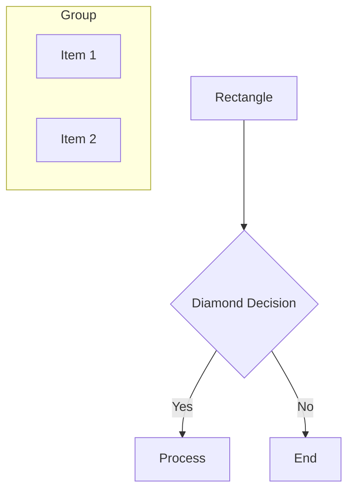
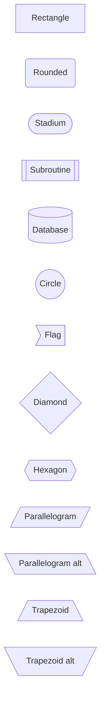
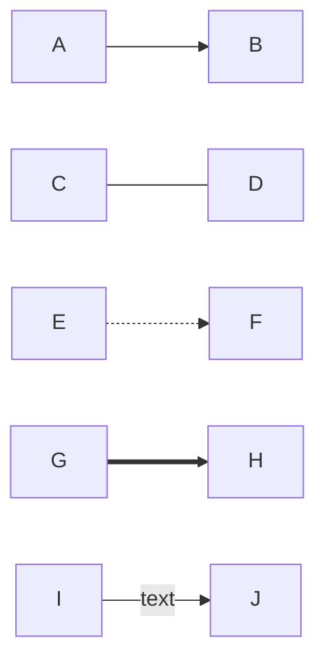
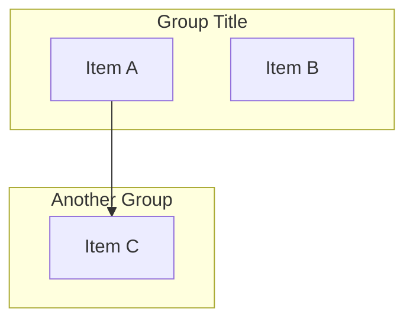
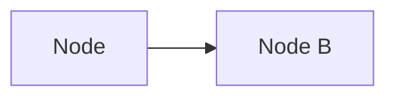
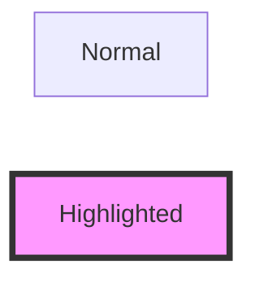
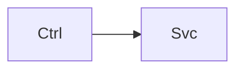
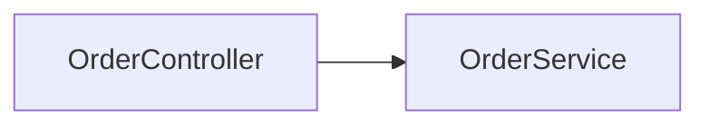
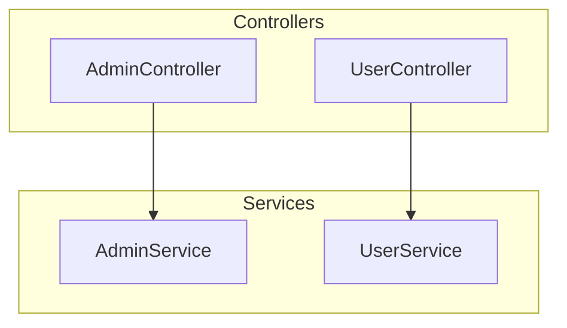

# Diagram Creation Guide

This guide explains how to add new diagrams and extend the viewer.

## Diagram Types

### 1. Composite Diagrams
High-level views that contain links to other diagrams.

```javascript
{
  id: 'overview',
  type: 'composite',
  children: ['controllers', 'services', 'database']
  // ... other properties
}
```

### 2. Detail Diagrams
Specific views showing detailed information.

```javascript
{
  id: 'controllers',
  type: 'detail',
  parent: 'overview'
  // ... other properties
}
```

## Adding a New Diagram

### Step 1: Define the Diagram

Edit `src/data/diagramRegistry.js`:

```javascript
export const diagramRegistry = {
  // ... existing diagrams ...

  myNewView: {
    id: 'myNewView',
    title: 'My New View',
    subtitle: 'A custom view',
    icon: '🎯',
    type: 'detail',
    description: 'Description of what this view shows',
    parent: 'overview',  // optional - creates breadcrumb link
    children: [],  // optional - for composite views
    code: `
flowchart TB
  subgraph MyGroup["My Group"]
    A[Component A]
    B[Component B]
  end

  A --> B

  click A "#ComponentA" "View Details"
    `
  }
}
```

### Step 2: Add Node Details (Optional)

Edit `src/data/nodeDetails.js`:

```javascript
export const nodeDetails = {
  // ... existing details ...

  ComponentA: {
    id: 'ComponentA',
    type: 'controller',  // or 'service', 'database', custom
    title: 'Component A',
    icon: '🔧',
    description: 'What this component does...',
    
    // For controllers
    endpoints: [
      { 
        method: 'POST', 
        path: '/api/my-endpoint', 
        description: 'Creates something',
        auth: 'ROLE_NAME'  // optional
      }
    ],

    // For services
    methods: [
      'doSomething(param1, param2): ReturnType',
      'doAnotherThing(): void'
    ],

    responsibilities: [
      'Responsibility 1',
      'Responsibility 2'
    ],

    // For database tables
    schema: [
      { 
        name: 'id', 
        type: 'BIGINT', 
        key: 'PRIMARY KEY',
        description: 'Optional description'
      },
      { name: 'name', type: 'VARCHAR(255)' }
    ],

    relationships: [
      'table_a.id → table_b.foreign_key'
    ],

    // Common fields
    services: ['ServiceA', 'ServiceB'],
    tags: ['Tag1', 'Tag2'],
    notes: ['Important note 1', 'Important note 2']
  }
}
```

## Mermaid Syntax Guide

### Flowchart (Most Common)



### Node Shapes



### Arrow Types



### Subgraphs (Groups)



### Click Actions



### Styling

Colors are automatically applied via theme, but you can customize:



## Best Practices

### 1. Use Clear Labels

❌ Bad:


✅ Good:


### 2. Group Related Items



### 3. Use Meaningful Icons

```javascript
icon: '🎛️'  // Controllers
icon: '⚙️'   // Services
icon: '💾'  // Database
icon: '🔄'  // Flows/Processes
icon: '🌐'  // External/API
icon: '🔐'  // Security
```

### 4. Keep Diagrams Focused

Don't try to show everything in one diagram. Split into logical views:
- Overview → High-level components
- Detail → Specific subsystems
- Flow → Step-by-step processes

### 5. Add Descriptions

Always add:
- `description` in diagram definition
- `description` in node details
- Comments in Mermaid code for complex diagrams

## Examples

### Example 1: Simple Controller → Service → DB

```javascript
myDiagram: {
  id: 'myDiagram',
  title: 'My Feature',
  icon: '🎯',
  type: 'detail',
  code: `
flowchart LR
  Controller[MyController<br/>POST /api/my-endpoint]
  Service[MyService<br/>processData()]
  DB[(my_table)]

  Controller --> Service
  Service --> DB

  click Controller "#MyController" "View Details"
  click Service "#MyService" "View Details"
  `
}
```

### Example 2: Process Flow

```javascript
myFlow: {
  id: 'myFlow',
  title: 'My Process Flow',
  icon: '🔄',
  type: 'detail',
  code: `
flowchart TB
  Start[User Action]
  Validate{Valid?}
  Process[Process Data]
  Save[(Save to DB)]
  Notify[Send Notification]
  End[Complete]

  Start --> Validate
  Validate -->|Yes| Process
  Validate -->|No| End
  Process --> Save
  Save --> Notify
  Notify --> End
  `
}
```

### Example 3: System Integration

```javascript
integration: {
  id: 'integration',
  title: 'External Integrations',
  icon: '🌐',
  type: 'detail',
  code: `
flowchart LR
  System[Our System]
  
  subgraph External
    API1[Payment Gateway]
    API2[KYC Provider]
    API3[Blockchain API]
  end

  System --> API1
  System --> API2
  System --> API3
  `
}
```

## Testing Your Diagram

1. Add the diagram to `diagramRegistry.js`
2. Save and the hot reload will show it in the sidebar
3. Click to view it
4. Check for:
   - Rendering errors (check browser console)
   - Layout issues (zoom out to see full diagram)
   - Click interactions (try clicking nodes)
   - Detail panel (if you added node details)

## Common Issues

### Diagram Not Showing
- Check console for errors
- Verify Mermaid syntax is valid
- Test syntax at https://mermaid.live/

### Click Not Working
- Ensure node ID matches exactly (case-sensitive)
- Check that node details are defined
- Use `click NodeName "#nodeId"` syntax

### Layout Issues
- Use `flowchart TB` (top-bottom) for vertical
- Use `flowchart LR` (left-right) for horizontal
- Add line breaks in labels: `A[Line 1<br/>Line 2]`
- Group related items in subgraphs

## Resources

- Mermaid Documentation: https://mermaid.js.org/
- Mermaid Live Editor: https://mermaid.live/
- Flowchart Syntax: https://mermaid.js.org/syntax/flowchart.html
- This Project's Examples: Check existing diagrams in `diagramRegistry.js`

Happy diagramming! 📊

